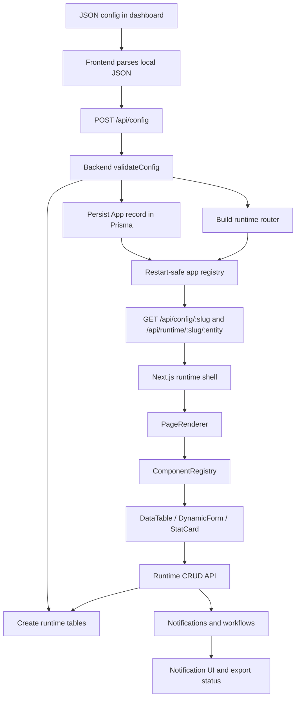

# MetaRuntime Architecture

This document describes the architecture of the MetaRuntime project as it exists in this repository. It is intentionally comprehensive: it covers the monorepo layout, the runtime model, the backend and frontend subsystems, the database layer, and the way configuration flows through the system from JSON input to a working application.

## 1. System Overview

MetaRuntime is a metadata-driven application runtime. The core idea is that a JSON configuration is the source of truth for an application. That configuration defines the application name, data entities, frontend pages, workflows, and auth roles. The platform then turns that config into:

- runtime database tables for dynamic entities,
- REST APIs for CRUD operations,
- frontend screens rendered from component metadata,
- authentication and role-aware access control,
- notifications and automation hooks,
- GitHub export output for deployable app generation.

The repository is structured as a monorepo with two primary applications:

- `apps/api`: the Express + Prisma backend runtime,
- `apps/web`: the Next.js frontend dashboard and app shell.

The root docs in `details.md`, `functionality.md`, `mininsta.md`, and `prompts.md` describe the intended platform behavior and examples, while the implementation lives under `apps/api` and `apps/web`.

## 2. Repository Layout

The root of the workspace contains the project-level documentation and the two runnable applications.

```text
meta-runtime/
  details.md
  functionality.md
  mininsta.md
  prompts.md
  architecture.md
  apps/
    api/
    web/
```

### 2.1 Backend application: `apps/api`

The backend is a TypeScript Node.js service built on Express and Prisma. It owns:

- configuration parsing and validation,
- dynamic table creation and runtime CRUD generation,
- user authentication,
- notification persistence and delivery helpers,
- workflow execution,
- GitHub export endpoints,
- startup bootstrapping of previously saved apps.

Key backend folders:

- `src/core/config`: config types, parser, and validator,
- `src/core/db`: Prisma client setup and dynamic schema generation,
- `src/core/api-factory`: route generation and CRUD handlers,
- `src/core/workflow`: workflow condition evaluation and execution,
- `src/features/notifications`: notification service and queue integration,
- `src/routes`: Express route modules,
- `src/middleware`: auth, validation, and error handling.

### 2.2 Frontend application: `apps/web`

The frontend is a Next.js 16 app using React 19, Tailwind CSS 4, and React Query. It provides:

- the landing page,
- login and registration pages,
- the dashboard for app creation and GitHub export,
- the per-app runtime shell,
- dynamic page rendering from configuration,
- shared client-side auth and query state,
- notification UI.

Key frontend folders:

- `app`: Next.js route segments and layouts,
- `core/api-client`: all HTTP access to the backend,
- `core/config`: frontend config types and parsing,
- `core/renderer`: component registry and page renderer,
- `features/notifications`: notification bell and polling hooks,
- `lib`: auth helpers and the React Query client.

## 3. High-Level Runtime Model

The project follows a config-driven pipeline:

1. A user creates or pastes a JSON config in the dashboard.
2. The frontend parses and submits the config to the backend.
3. The backend validates and normalizes the config into a safe `AppConfig` shape.
4. The config is persisted in Prisma as part of an `App` record.
5. Each entity in the config is converted into a runtime table.
6. The backend builds runtime CRUD routes for those entities.
7. The frontend later loads the saved config and renders pages from it.
8. Page components call the runtime APIs to load, create, update, and delete live data.
9. Workflows and notifications react to data changes and events.
10. GitHub export uses the same saved config to generate a deployable project.

The important architectural point is that application shape is not hard-coded per customer app. The same backend and frontend code serve every generated app by interpreting metadata at runtime.

## 4. Data Model And Persistence

The persistent schema lives in Prisma under `apps/api/prisma/schema.prisma`.

### 4.1 Static Prisma models

There are three main static models:

- `User`: holds identity, email, optional name/password, and role,
- `App`: stores the saved JSON config and links it to an owner,
- `Notification`: stores user notifications and unread state.

These models support the platform itself. They are not the generated entity data. They are the platform’s control-plane data.

### 4.2 Dynamic entity data

Runtime entities are not represented as fixed Prisma models. Instead, they are created dynamically from the app config. The backend’s schema generation layer maps each entity definition to a physical database table and then issues raw SQL through Prisma’s database connection.

That means the platform has two data layers:

- control-plane data: users, apps, notifications,
- runtime data: entity tables generated from JSON config.

This split is central to the architecture. It keeps the runtime flexible without forcing every generated application into a predetermined static schema.

## 5. Configuration Architecture

Configuration is the core contract between backend and frontend.

### 5.1 Config types

The backend config model is defined in `apps/api/src/core/config/types.ts`. It describes:

- `FieldType`: supported field value kinds such as string, number, boolean, date, relation, email, password, and text,
- `FieldDef`: field metadata including required, unique, default values, and relation descriptors,
- `EntityDef`: entity name, fields, and optional timestamps,
- `PageComponent`: component type, entity binding, optional title, and optional field list,
- `PageDef`: page name, slug, icon, component list, and optional role gating,
- `WorkflowDef`: trigger, entity, optional condition, and action list,
- `WorkflowAction`: action type and action-specific config,
- `AuthConfig`: providers and roles,
- `AppConfig`: the complete application contract.

The frontend mirrors the same concepts in `apps/web/core/config`, so both sides speak the same language.

### 5.2 Parsing and validation

The backend parser in `apps/api/src/core/config/parser.ts` has three responsibilities:

- parse raw JSON strings safely,
- validate already-decoded config objects,
- provide a safe fallback config when input is invalid.

`validateConfig` in `apps/api/src/core/config/validator.ts` applies Zod schemas with defaults. This layer is intentionally resilient:

- missing root sections fall back to safe defaults,
- missing pages/entities/workflows become empty arrays,
- auth defaults to credentials with `user` and `admin` roles,
- unsupported component or field values are normalized or warned about rather than crashing the system.

The architecture choice here is important: the platform prefers a partially working app with warnings over a failed deployment caused by malformed config.

### 5.3 Config lifecycle

Config moves through the system in these forms:

- raw JSON text in the dashboard,
- parsed object in the frontend,
- validated `AppConfig` on the backend,
- JSON stored in Prisma in the `App.config` column,
- parsed `AppConfig` again when loading an app at startup or runtime.

That repeated parsing is deliberate. It protects the runtime from stale or malformed data regardless of where the config originated.

## 6. Backend Architecture

The backend is the platform’s execution engine.

### 6.1 Server entrypoint

`apps/api/src/index.ts` is the main server entry point. It performs startup responsibilities in a fixed order:

- loads environment variables with `dotenv.config()`,
- constructs the Express app,
- mounts JSON and URL-encoded body parsers,
- enables CORS for the configured frontend origin,
- exposes `/health` for liveness checks,
- mounts auth, config, runtime, notification, and export routers,
- installs 404 and global error handlers,
- loads previously saved apps from the database,
- rebuilds runtime routers from saved configs,
- starts listening on the configured port.

This means a server restart does not lose generated runtime routes. The system rebuilds its in-memory router registry from persisted app records.

### 6.2 Route layers

The backend routes are organized by responsibility:

- `auth.routes.ts`: login, registration, current user, logout,
- `config.routes.ts`: app config CRUD and runtime router registration,
- `runtime.routes.ts`: dispatch layer for generated runtime routes,
- `notification.routes.ts`: notification API surface,
- `githubExport.routes.ts`: export job orchestration.

The route model separates platform management from generated runtime data. Control-plane endpoints are fixed and explicit; runtime endpoints are created dynamically from config.

### 6.3 Dynamic route generation

`apps/api/src/core/api-factory/routeBuilder.ts` converts an `AppConfig` into an Express router.

For each entity, it registers:

- `GET /<entity>` to list rows,
- `GET /<entity>/:id` to fetch a single row,
- `POST /<entity>` to create,
- `PUT /<entity>/:id` to update,
- `DELETE /<entity>/:id` to delete,
- `POST /<entity>/init-table` to create the runtime table.

The actual handler implementations come from `apps/api/src/core/api-factory/crudFactory.ts`.

### 6.4 CRUD handler design

The CRUD factory is responsible for request-level behavior:

- validating required fields,
- stripping unknown fields from payloads,
- calling the dynamic database helpers,
- returning normalized success and error responses,
- translating missing rows into 404s,
- creating tables on demand.

The handlers treat relation fields specially. Relation fields are not written directly into the raw table generator in the same way as scalar fields, because runtime relational handling is more complex than a simple column mapping.

This layer is where the runtime feels like a normal REST backend even though the tables are generated dynamically underneath.

### 6.5 Dynamic database layer

The `apps/api/src/core/db` folder contains the runtime schema generation layer.

- `prisma.ts` initializes the Prisma client,
- `schemaGenerator.ts` creates runtime tables and performs dynamic reads and writes.

The architecture uses Prisma as the database gateway but not as a static ORM for every runtime entity. Instead, Prisma provides a stable connection to PostgreSQL while the generated entity tables are handled with raw SQL and table metadata.

This gives the system flexible schema generation without sacrificing the existing Prisma-managed models.

### 6.6 Workflow engine

The workflow engine lives in `apps/api/src/core/workflow`.

It has two layers:

- `conditions.ts`: evaluates simple workflow conditions,
- `executor.ts`: executes actions for matching workflows.

Workflow definitions are part of the app config. They can react to entity events such as create, update, delete, or scheduled triggers.

The executor is defensive by design:

- a false condition skips the workflow entirely,
- each action is wrapped in its own try/catch,
- one failed action does not stop the rest of the workflow,
- action types are dispatched by `type`.

Supported actions in the current architecture are:

- create a notification record,
- POST to a webhook,
- write directly to a table,
- log a placeholder email action.

### 6.7 Notifications subsystem

The notification subsystem lives under `apps/api/src/features/notifications`.

There are two key layers:

- `notificationService.ts`: database-facing notification operations,
- `notificationQueue.ts`: asynchronous job processing through Bull and Redis.

The service layer owns the canonical notification behavior:

- create one notification,
- list a user’s notifications,
- mark one notification as read,
- mark all notifications as read,
- broadcast to a role or all users.

The queue layer decouples async notification production from request handling. That is useful for workflow actions or background jobs that should not block the API response path.

### 6.8 Authentication and authorization

Authentication is credentials-based and JWT-backed. The backend provides login and registration flows, then protects private routes with middleware.

Architecturally, auth is used in three places:

- route access control on the server,
- user identity in notification and workflow operations,
- token handling in the frontend client.

The `User.role` field powers simple role checks such as admin-only actions.

### 6.9 Error handling and validation middleware

The backend separates validation and error handling into middleware so route handlers stay focused on business logic.

- `validate.middleware.ts` handles request validation concerns,
- `errorHandler.ts` provides not-found and global error handlers,
- `auth.middleware.ts` checks authenticated access and role requirements.

The architecture assumes errors should be normalized as structured JSON responses rather than leaking raw exceptions.

### 6.10 GitHub export feature

The backend also exposes a GitHub export path through `githubExport.routes.ts` and the `features/github-export` service.

This flow takes an app config, generates a deployable project, initializes a git repository, and pushes to a GitHub repository using a user-provided token. Export progress is tracked in memory and polled by the frontend.

This feature sits alongside the runtime rather than inside it. It is a packaging/export layer that reuses the same config source of truth.

## 7. Frontend Architecture

The frontend is the user-facing control plane and runtime shell.

### 7.1 Next.js app structure

The Next.js app in `apps/web` uses the App Router.

Key routes include:

- `app/page.tsx`: landing page,
- `app/(auth)/login/page.tsx`: login page,
- `app/(auth)/register/page.tsx`: registration page,
- `app/dashboard/page.tsx`: dashboard and app management,
- `app/apps/[slug]/page.tsx`: runtime shell for a specific app,
- `app/layout.tsx`: root layout,
- `app/providers.tsx`: client-side providers wrapper.

The root layout wraps the application in the providers component so the React Query client is available everywhere.

### 7.2 Dashboard responsibilities

The dashboard is the main control surface for app authors. It handles:

- loading all apps,
- creating a new app from JSON config,
- editing the app name and slug,
- triggering GitHub export jobs,
- showing the notification bell,
- redirecting unauthenticated users to login.

It uses React Query for server state and local component state for form editing and export state.

### 7.3 Runtime shell

The `apps/web/app/apps/[slug]/page.tsx` route is the runtime shell for a specific saved app.

The shell is responsible for:

- loading the app config by slug,
- determining the pages available in the app,
- showing a page navigation structure,
- rendering the selected page through the page renderer,
- letting the user interact with runtime data through the generated APIs.

This is the part of the frontend that turns config into an app experience.

### 7.4 Shared query state

`apps/web/lib/queryClient.ts` defines a singleton React Query client. The providers component mounts that client at the top of the app tree.

The choice of React Query is architectural rather than incidental:

- it centralizes server state,
- it simplifies refetching after mutations,
- it keeps dashboard, runtime data, and notifications in sync.

### 7.5 Frontend auth state

`apps/web/lib/auth.ts` manages token and user persistence in localStorage. The frontend uses this to decide whether to show protected routes or redirect to login.

This auth layer is client-side convenience state, not the source of truth. The backend still enforces auth with middleware.

### 7.6 API client

`apps/web/core/api-client/index.ts` is the single HTTP abstraction used by the frontend.

Its architecture is intentionally centralized:

- it attaches the auth token automatically,
- it normalizes backend responses,
- it handles endpoint path construction,
- it exposes typed functions for auth, config, runtime data, notifications, and GitHub export.

That keeps fetch logic out of the UI components and gives the app one place to update when backend routes change.

### 7.7 Dynamic renderer

The renderer layer is the frontend mirror of the backend route factory.

- `core/renderer/PageRenderer.tsx` loops through the components on a page and renders them,
- `core/renderer/ComponentRegistry.tsx` maps metadata component types to React components,
- `core/renderer/components/*` contains the concrete UI primitives for tables, forms, and stat cards.

This architecture is important because it means page composition is data-driven. Pages do not import specific business screens. They ask the registry for a component by type and pass in the entity and field metadata.

The registry also defines safe fallbacks for unsupported component types so a bad config does not take down the page.

### 7.8 Notification UI

The frontend notification feature is split between:

- `features/notifications/NotificationBell.tsx`,
- `features/notifications/useNotifications.ts`.

The bell sits in the dashboard header and displays unread counts and a dropdown/list experience. It connects to the backend notification APIs and keeps the user aware of background activity such as workflows or queue-driven events.

## 8. End-to-End Request Flows

This section describes the main flows through the system.

### 8.1 App creation flow

1. The user enters a name, slug, and JSON config in the dashboard.
2. The frontend parses the JSON locally to catch malformed input early.
3. The app creation request is sent to the backend config route.
4. The backend validates and normalizes the config.
5. A new `App` record is stored in Prisma.
6. Each entity is used to create a runtime table.
7. The backend creates a runtime router for the app and stores it in the in-memory router map.
8. The dashboard updates to show the newly created app.

### 8.2 Runtime page load flow

1. The user opens an app by slug.
2. The frontend fetches the saved app config from the backend.
3. The config is parsed again on the client.
4. The page shell determines the available pages and the selected page.
5. `PageRenderer` renders each configured component.
6. Each rendered component uses the API client to fetch or mutate runtime data.

### 8.3 CRUD record flow

1. A table component requests entity data through the runtime API.
2. The API client sends the request to the generated route.
3. The CRUD factory validates the payload and delegates to the dynamic database layer.
4. The database helper performs the actual SQL read or write.
5. The response is normalized and the query cache is invalidated on the frontend.

### 8.4 Notification flow

1. A workflow or queue job decides a notification should be created.
2. The notification service writes the record to Prisma.
3. The frontend bell reads notification state from the notification endpoints.
4. The user can mark one or all notifications as read.

### 8.5 Workflow execution flow

1. A runtime event occurs for an entity.
2. Matching workflows are selected by trigger and entity.
3. Conditions are evaluated.
4. Each action runs independently in sequence.
5. Any action failure is logged but does not prevent later actions from running.

### 8.6 GitHub export flow

1. The user supplies a slug, repository name, privacy choice, and GitHub token.
2. The frontend posts the request to the export endpoint.
3. The backend generates a deployable project from the stored app config.
4. A job is created and tracked in memory.
5. The frontend polls for job status and displays progress.

## 9. Architecture Diagram



## 10. Major Design Decisions

### 10.1 Config-first application model

The application is defined by metadata rather than hand-written screens and routes. This reduces duplication and allows one codebase to host many generated apps.

### 10.2 Separate control-plane and runtime-plane data

Static app data and dynamic runtime entity data are intentionally separated. The control plane uses Prisma models; the runtime plane uses generated tables and raw SQL.

### 10.3 Shared config contract across backend and frontend

Both sides understand the same configuration concepts. That avoids mismatches between what the backend can store and what the frontend can render.

### 10.4 Safe defaults and graceful degradation

The system tries to continue operating when configs are incomplete or partially invalid. Unknown values are normalized, warnings are emitted, and visible fallbacks are rendered in the UI.

### 10.5 Centralized API and registry layers

The API client and component registry prevent the rest of the app from hard-coding route strings or component lookups everywhere. That keeps the system extensible.

## 11. Current Feature Boundaries

The repository currently implements a broad runtime surface, but some areas are still explicit placeholders rather than full end-user features:

- chart and detail-view components currently have placeholder renderers,
- workflow email actions currently log a message instead of sending real mail,
- relation handling exists in the config model but is only partially reflected in the runtime table generation path,
- the frontend and backend both contain scaffolding for dynamic behavior that is intentionally resilient to missing or unknown config values.

That boundary is part of the architecture. The platform is designed to be extensible without requiring every advanced capability to be fully productized at once.

## 12. Operational Notes

### 12.1 Backend startup behavior

At startup, the backend loads all saved apps from the database, parses each stored config, rebuilds runtime routers, and logs how many apps were loaded. This makes the runtime durable across process restarts.

### 12.2 Environment-driven behavior

Important environment variables include:

- `DATABASE_URL` for Prisma,
- `PORT` for the backend listener,
- `FRONTEND_URL` for CORS,
- `NEXT_PUBLIC_API_URL` for the frontend API client,
- `REDIS_URL` for Bull queues.

### 12.3 Database and queue infrastructure

The platform expects PostgreSQL for persistence and Redis for asynchronous queue processing. The queue layer is used for notifications and can be extended for other background tasks.

## 13. File Responsibility Map

### 13.1 Backend

- `apps/api/src/index.ts`: server bootstrap and route mounting,
- `apps/api/src/core/config/types.ts`: config schema types,
- `apps/api/src/core/config/parser.ts`: parse and default config objects,
- `apps/api/src/core/config/validator.ts`: validate and normalize config,
- `apps/api/src/core/db/prisma.ts`: Prisma client initialization,
- `apps/api/src/core/db/schemaGenerator.ts`: runtime table generation and raw SQL helpers,
- `apps/api/src/core/api-factory/crudFactory.ts`: CRUD handler creation,
- `apps/api/src/core/api-factory/routeBuilder.ts`: runtime router creation,
- `apps/api/src/core/workflow/conditions.ts`: workflow condition evaluation,
- `apps/api/src/core/workflow/executor.ts`: workflow action execution,
- `apps/api/src/features/notifications/notificationService.ts`: notification persistence logic,
- `apps/api/src/features/notifications/notificationQueue.ts`: async notification jobs,
- `apps/api/src/routes/*`: platform and runtime HTTP APIs,
- `apps/api/src/middleware/*`: auth, validation, and error handling.

### 13.2 Frontend

- `apps/web/app/layout.tsx`: root HTML shell and global providers,
- `apps/web/app/page.tsx`: landing page,
- `apps/web/app/dashboard/page.tsx`: app dashboard and export UI,
- `apps/web/app/apps/[slug]/page.tsx`: app runtime shell,
- `apps/web/app/providers.tsx`: React Query provider wrapper,
- `apps/web/core/api-client/index.ts`: backend request layer,
- `apps/web/core/config/*`: frontend config parsing and types,
- `apps/web/core/renderer/PageRenderer.tsx`: page composition engine,
- `apps/web/core/renderer/ComponentRegistry.tsx`: component lookup table,
- `apps/web/core/renderer/components/*`: reusable rendered blocks,
- `apps/web/features/notifications/*`: notification UI,
- `apps/web/lib/auth.ts`: browser auth storage helpers,
- `apps/web/lib/queryClient.ts`: React Query singleton.

## 14. Summary

MetaRuntime is not a single-purpose app. It is a runtime platform built around one idea: a JSON config can define a working application end to end. The backend interprets and persists that config, generates tables and APIs, and runs background behavior like workflows and notifications. The frontend reads the same config and renders a dynamic UI that talks to those generated APIs.

The architecture is therefore best understood as two coordinated systems:

- a control plane that manages users, apps, config, exports, and platform services,
- a runtime plane that turns app metadata into live screens, tables, and CRUD endpoints.

That separation is what makes the platform flexible, restart-safe, and extensible.